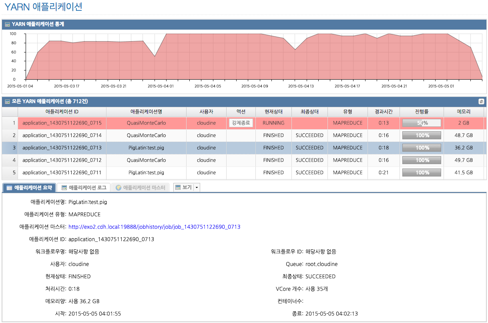
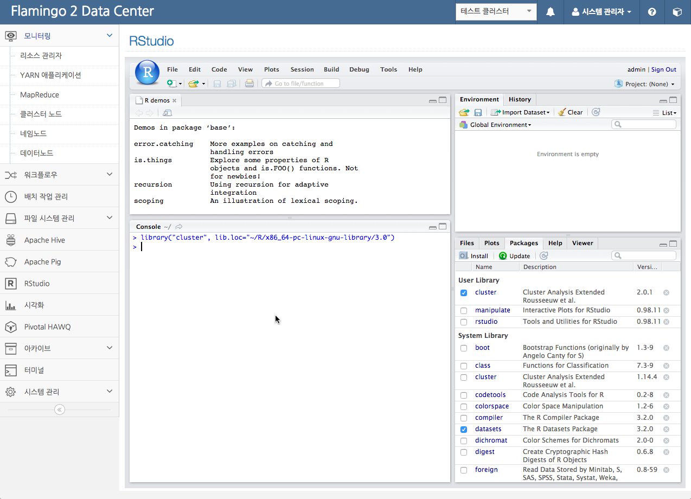
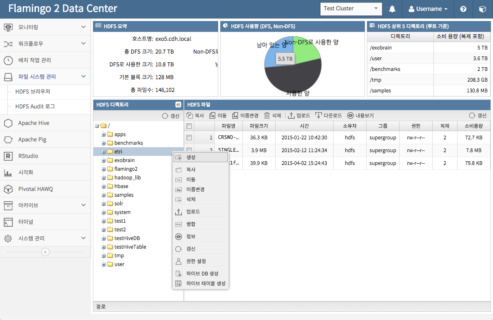
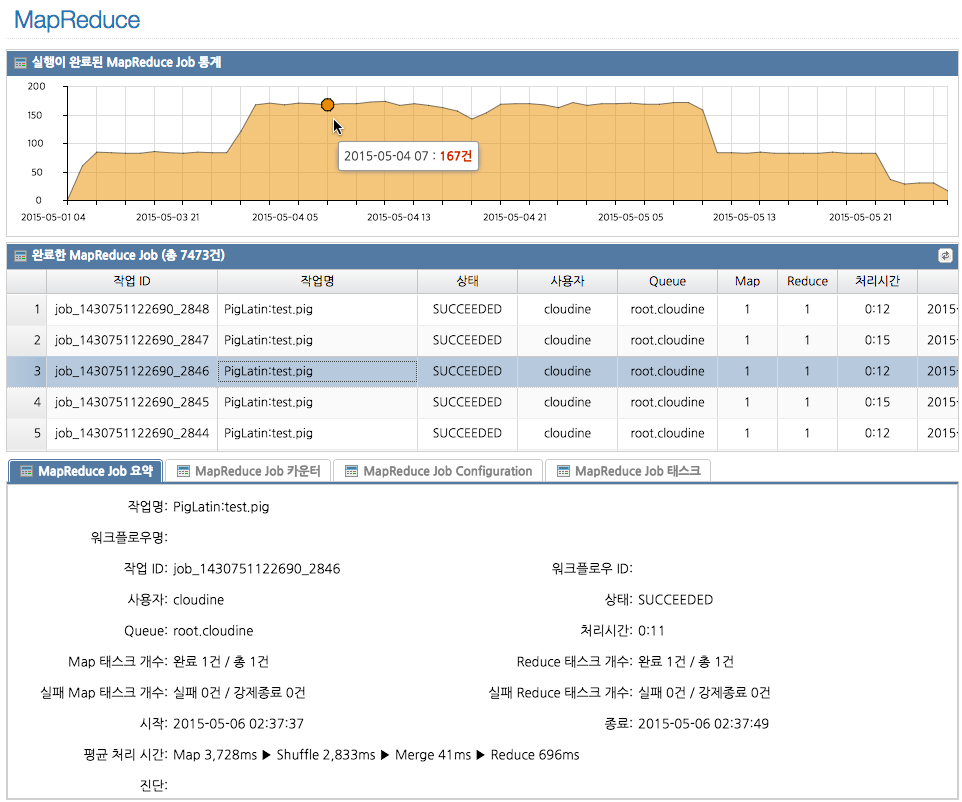
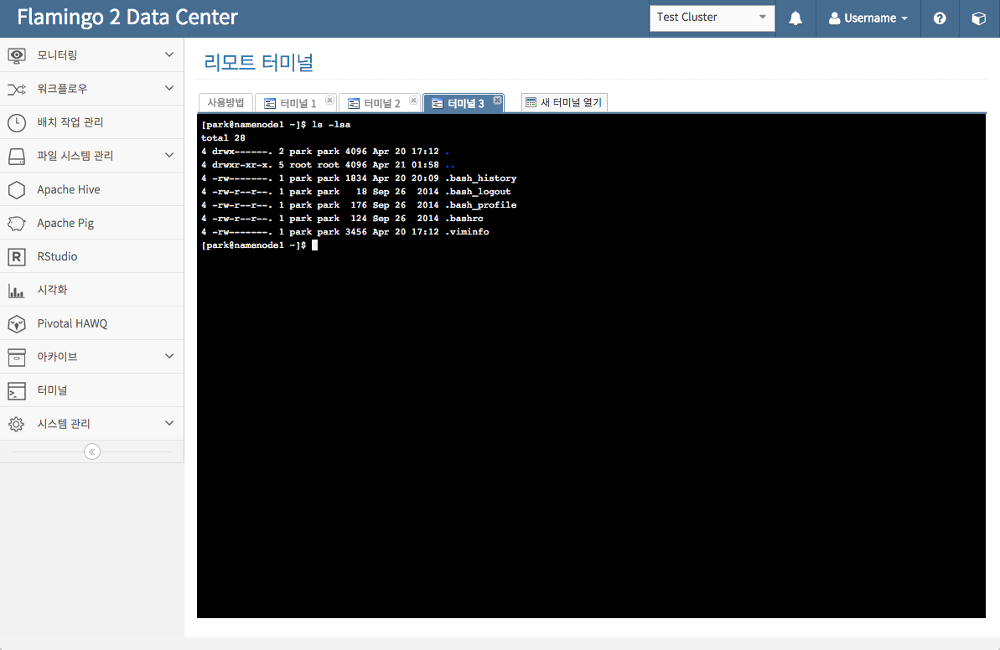
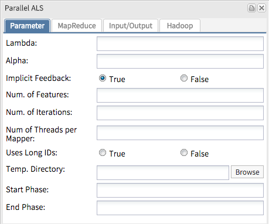
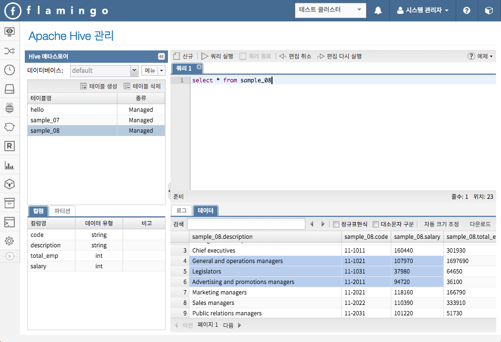
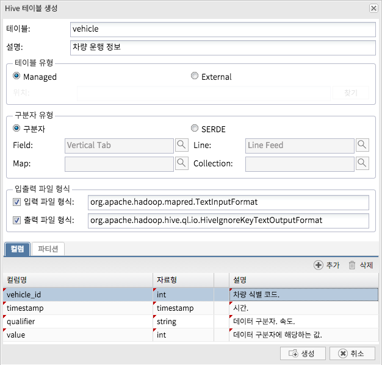
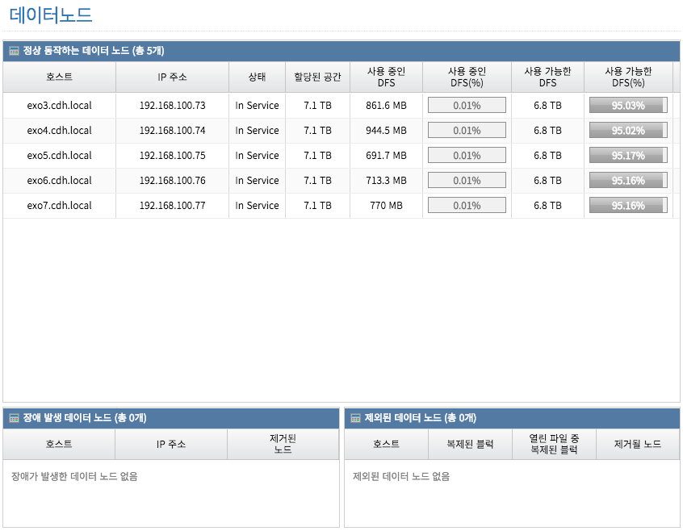
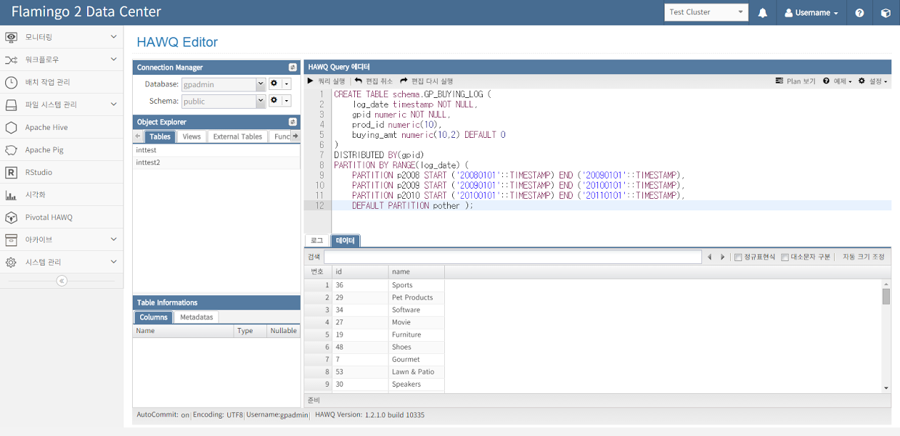

## Flamingo

Flamingo는 Apache Hadoop EcoSystem을 기반으로한 빅데이터 인프라 환경을 보다 편리하고 분석 및 개발에 집중할 수 있으면서, 다양한 사용자들이 협업할 수 있는 환경을 제공해주는 빅데이터 플랫폼입니다.

### 라이센스

* Community License : GPL v3

### Flamingo 1 대비 주요 변경사항

* 통계 및 차트 기능 강화
* 시각화 기능 추가
* Hive 관련 기능 재개발
* Pig 관련 기능 재개발
* HDFS 브라우저 관련 기능 재개발
* 워크플로우 디자이너 BPM 적용
* Mahout 통합
* Spark 지원 추가
* Pivotal HAWQ 관련 기능 추가
* ExtJS 4 > ExtJS 5 마이그레이션
* 프로젝트 구성 변경
* 모니터링 Agent 기능 강화
* YARN Application 관리 기능 강화
* 기타 모니터링 기능 강화
* 아카이브 기능 추가
* 리모트 터미널 추가
* RStudio 통합 추가

### 환경 요구사항

* JDK 1.7 이상
* Apache Tomcat 7 최신 버전 (WebSocket 지원버전부터 사용해야 함)
* Apache Hadoop 2.0 이상
* Apache Hive 0.13 이상
* MySQL 5.1 이상 (UTF-8)
* node.js
* R 3.0
* Pivotal HAWQ 1.0 이상 (PHD 2 이상)

### 제공하는 기능

* 분산 파일 시스템 관리
  * 파일 시스템 브라우저
  * Audit
* R 및 RStudio 통합
  * Flamingo와 RStudio SSO
  * RHive & RHadoop 지원
* 모니터링
  * Resource Manager
  * Namenode 및 Datanode
  * 클러스터 노드
  * YARN Application
    * Application 강제종료
    *  Queue로 이동
  * Application 로그
  * MapReduce Job
* Pivotal HAWQ
  * HAWQ Query Editor
  * Database & Table Management
  * Role Management
  * Query Executor
* Apache Hive
  * Hive Query Editor
  * Database & Table Management
  * Hive Metastore Integration
  * Query Executor
* Apache Pig
* 워크플로우 디자이너
  * MapReduce
  * Hive QL
  * Pig Latin
  * Spark
  * Java
  * Python
  * Mahout
  * Ankus
  * ETL
  * UIMA
  * Parallel Join/Fork
* 배치 스케줄러
* 아카이브
  * YARN Application
  * MapReduce Job
* 시스템 관리
  * 메뉴 관리
  * 사용자 관리
  * 권한 관리
  * Apache HAWQ 사용자 관리

